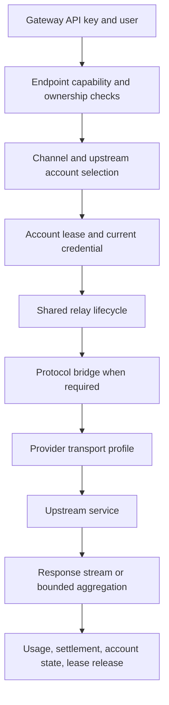

# Subscription upstream feasibility and implementation plan

Status: proposal; implementation has not started.
Reviewed: 2026-10-06.
One Gateway baseline: `50c48f7085b67fe4037fc9821916d95dd36affe1`.
Sub2API reference: `b8dece9000c68815a5b867ca5a1e6f236e173905`.

## Scope and conclusion

Subscription upstreams are technically feasible with the existing shared relay
lifecycle. Add credential management, account scheduling, and provider transport
profiles while retaining gateway authentication, channels, protocol bridges,
quota settlement, and the TypeScript administration UI.

Here, subscription means an upstream product account with subscription access.
Selling monthly plans to One Gateway users is a separate feature.

Planning default: self-hosted use of the owner's subscriptions. Account ownership
must be explicit from the first migration. A shared account pool or a hosted
multi-user offering requires a separate product decision; successful personal
authentication does not establish support for those deployment models.

Accepted direction: prioritize officially documented and supported integration
methods. The first deliverable is an owner-bound ChatGPT plan connection using
Sign in with ChatGPT and the public Responses endpoint. Follow the documented
authorization, refresh, deployment, and endpoint capability boundaries.

Sub2API remains an architectural reference for account management and scheduling.
Its internal-endpoint compatibility paths are research findings, not planned
fallbacks. Add other subscription providers when an officially supported path
fits the intended deployment; existing API-key integration remains available.

## Evidence and provider feasibility

| Path | Evidence | Decision |
| --- | --- | --- |
| ChatGPT plan through Sign in with ChatGPT | OpenAI documents subscription-authorized OAuth access to public `/v1/responses` for open-source/local apps and a self-hosted VM procedure. | Preferred first implementation; verify entitlement with an actual completed request. |
| Codex internal transport used by Sub2API | Its OpenAI OAuth account path uses `chatgpt.com/backend-api/codex/responses`, account headers, and request normalization. | Research reference only; excluded from the implementation roadmap and automatic fallback. |
| Claude subscription | Sub2API has OAuth refresh, Bearer authentication, and provider-specific beta/request handling. | Technically identifiable; current Anthropic documentation restricts third-party subscription credential mediation. Keep outside the first release commitment. |
| Gemini CLI / Code Assist subscription | Sub2API adds OAuth, project/tier discovery, an internal endpoint, and request/response envelopes. | Technically identifiable; Google explicitly restricts third-party direct access to the CLI service. Keep outside the first release commitment. |
| API-key-based coding subscriptions | May already work through an existing compatible channel, depending on endpoint and model support. | Classify by the actual protocol and entitlement; add an OAuth subsystem only when necessary. |

Sources: [OpenAI overview](https://developers.openai.com/siwc/token-sharing-open-source),
[inference](https://developers.openai.com/siwc/token-sharing-open-source/models-and-inference),
[self-hosted VMs](https://developers.openai.com/siwc/token-sharing-open-source/self-hosted-vms),
[Anthropic credential guidance](https://code.claude.com/docs/en/legal-and-compliance#authentication-and-credential-use),
and [Gemini CLI service restrictions](https://geminicli.com/docs/resources/tos-privacy/).

These findings establish implementation paths, not tested account access. No
subscription credentials or live provider calls were used in this assessment.
OpenAI's public documentation distinguishes open-source/local use from paid or
remotely hosted offerings; the latter are directed to its interest process.

### What to learn from Sub2API

| Component | Useful design | Reference at the reviewed commit |
| --- | --- | --- |
| Accounts | Separate provider identity, credentials, concurrency, and scheduling state. | [Account schema](https://github.com/Wei-Shaw/sub2api/blob/b8dece9000c68815a5b867ca5a1e6f236e173905/backend/ent/schema/account.go) |
| Credential refresh | Coordinate request-time and background refresh; re-read state before rotating credentials. | [OAuth refresh](https://github.com/Wei-Shaw/sub2api/blob/b8dece9000c68815a5b867ca5a1e6f236e173905/backend/internal/service/oauth_refresh_api.go) |
| Scheduling | Filter capabilities, retain session affinity, and account for available capacity. | [OpenAI scheduler](https://github.com/Wei-Shaw/sub2api/blob/b8dece9000c68815a5b867ca5a1e6f236e173905/backend/internal/service/openai_account_scheduler.go) |
| Capacity | Hold and release account slots across the full request lifetime. | [Concurrency service](https://github.com/Wei-Shaw/sub2api/blob/b8dece9000c68815a5b867ca5a1e6f236e173905/backend/internal/service/concurrency_service.go) |
| Codex transport | Separate OAuth-specific URLs, headers, and Responses behavior from API-key requests. | [Upstream request](https://github.com/Wei-Shaw/sub2api/blob/b8dece9000c68815a5b867ca5a1e6f236e173905/backend/internal/service/openai_gateway_forward.go) |
| Claude transport | Provider authentication and beta handling belong at the upstream boundary. | [Claude request](https://github.com/Wei-Shaw/sub2api/blob/b8dece9000c68815a5b867ca5a1e6f236e173905/backend/internal/service/gateway_upstream_request.go) |
| Gemini transport | OAuth Code Assist wraps native Gemini content in a provider envelope. | [Gemini forwarding](https://github.com/Wei-Shaw/sub2api/blob/b8dece9000c68815a5b867ca5a1e6f236e173905/backend/internal/service/gemini_messages_compat_service.go) |

The reviewed Sub2API [LICENSE](https://github.com/Wei-Shaw/sub2api/blob/b8dece9000c68815a5b867ca5a1e6f236e173905/LICENSE)
is LGPL version 3. This plan proposes independently written One Gateway code
under the project's existing licensing, with reference attribution. Importing or
copying Sub2API implementation code would require a separate licensing decision.
Its Ent/PostgreSQL/Vue application is not a drop-in module for this GORM/React app.

## Gaps in One Gateway

| Existing component | Reuse | Required change |
| --- | --- | --- |
| `model/channel.go` | Groups, models, priorities, mapping, and channel administration. | Add an optional account reference; keep OAuth credentials out of `Channel.Key` and generic channel JSON. |
| `relay/lifecycle` | Reservation, retries, cancellation, error presentation, and settlement. | Select by capability and ownership; acquire an account lease and resolve current credentials per attempt. |
| `relay/lifecycle/forward.go` | Native and converted request execution. | Replace exact channel-type assumptions for subscription routes with explicit transport capabilities. |
| `middleware/distributor.go` | Gateway group and channel context. | Avoid selecting an incompatible subscription before endpoint validation; use the same capability selector as native entrypoints. |
| `relay/native/transport.go` | HTTP transport and native response handling. | Add transport profiles; existing Anthropic/Gemini API-key headers cannot represent subscription OAuth. |
| `relay/bridge` | Existing Chat/Messages/Gemini conversions. | Add a direct Chat-to-Responses bridge for Chat clients using a Responses-only subscription. |
| `relay/native/usage.go` and `relay/billing` | Input/output accounting and once-only settlement. | Preserve cache/reasoning details separately; distinguish provider consumption from gateway charges. |
| `monitor` | Channel visibility and health. | Treat reauthorization, cooldown, overload, and permanent disablement as different account states. |
| `controller/background.go` | Existing API-key background jobs. | Check subscription capabilities before creating a job; do not imply subscription background support. |
| `web/default` | TypeScript UI, channel editor, logs, and dashboard. | Add an account connection page and account-aware channel controls. |

An HTTP deployment of Sub2API could also be configured as an upstream. That is
a possible integration experiment, but adds a second state store, scheduler,
retry policy, and billing boundary. Prefer an integrated implementation for the
long-term project; a sidecar does not resolve provider access restrictions.

## Proposed architecture

### API compatibility, load balancing, and failure isolation

Accepted user requirements: subscription access must coexist with existing API
access; a subscription outage must not disable healthy API channels. Reuse the
existing selector, lifecycle, protocol bridges, and settlement code where their
contracts fit. Extend these components rather than adding a second gateway loop.

Existing API-only configurations retain their endpoints, credentials, model
mapping, protocol preservation, and billing behavior. Subscription restrictions
apply only to the selected subscription transport. API-only operation must not
depend on OAuth configuration, subscription encryption keys, refresh workers, or
subscription coordination services. Database changes are additive.

The current selectors in `model/cache.go` and `model/ability.go` use priority
and random selection. `Channel.Weight` exists but is not used by those selectors.
`relay/lifecycle/forward.go` currently retries with `Type: failed.Type`. Therefore
weighted selection and subscription-to-API failover need explicit implementation
and tests; neither should be described as already available.

Define routing policy independently of provider/channel type:

| Policy | Eligible candidates and fallback |
| --- | --- |
| `api_only` | Existing API channels; the default for existing configurations. |
| `subscription_only` | Authorized subscription accounts; no implicit paid API fallback. |
| `subscription_then_api` | Prefer eligible subscriptions, then healthy compatible API channels; selecting this policy explicitly enables paid fallback. |
| `mixed` | Both sources compete within priority tiers, using configured weights and available capacity. |

Reuse group/model eligibility and priority semantics. Add ownership, operation,
request-feature, and account-readiness filters before selecting a candidate.
If a request needs a field unsupported by subscriptions but supported by API
channels, a mixed policy selects an API channel without altering that field.
Preserve legacy equal-random selection by default; enable weighted selection
explicitly and define unset/zero weights as equal default weights, with disablement
controlled separately. Cached and database selection must follow the same rules.

Skip accounts that are cooling down, refreshing without a usable token, revoked,
or full. Do not hold the shared channel-cache lock during refresh, network I/O,
or capacity waits. Give subscription attempts bounded time and reserve time in
the overall request deadline for configured API fallback. Use bounded refresh
and probe workers, independent account leases, and a cap on total subscription
in-flight work so an outage cannot exhaust capacity needed for API traffic.
Coordination failure makes subscription candidates unavailable while API-only
traffic continues normally.

Track health at the failing resource: account credential failures affect channels
referencing that account; model-specific limits affect that account/model;
transport failures affect the relevant endpoint. Never disable every channel for
a model or provider because one subscription failed. Keep existing API channel
health handling independent and scope cooldown recovery probes accordingly.

Use a shared request attempt budget and one orchestrating lifecycle. Broaden
retry selection to compatible candidates permitted by the route policy. Rebuild
the converter, transport, credentials, model mapping, and billing context on each
attempt from the immutable original request. Do not reuse a subscription-mutated
body or headers when switching to an API channel. Keep the client protocol fixed.

Cross-channel retry remains limited to safe failures before client output and
before non-replayable upstream work. Once streaming output starts, terminate a
failed stream accurately; later requests may select a healthy API channel.
Pinned channels and account-bound conversation state retain their constraints.
Charge according to the actual attempt outcome and channel, using existing
reservation/refund/settlement ownership; record fallback reason and source type.

Required acceptance scenarios:

- API-only fixtures pass with subscription support disabled and with its services unavailable.
- Expired/revoked credentials, refresh timeout, 429, overload, and full account
  capacity skip or fail over to a healthy API channel under the configured policy.
- Unsupported subscription fields select a compatible API candidate when allowed;
  the API receives the original fields and its own authentication headers.
- Equal model names across sources do not bypass group, owner, or capability checks.
- Concurrent subscription failures do not block API selection or exhaust shared
  locks/workers; load tests measure API latency and error rate during the outage.
- Weight/priority behavior matches across cached and database paths, recovery
  restores eligible accounts, and request attempts stay bounded.
- A mid-stream subscription failure never splices an API stream into it or starts
  duplicate work; subsequent API requests still succeed.

### Request flow

Use three independent concepts: client protocol, upstream transport profile,
and credential kind. For example, `openai_responses` + `chatgpt_plan_public` +
`oauth` is different from `openai_responses` + `codex_internal` + `oauth`.
Their tokens, request fields, and entitlement checks are not interchangeable.

Suggested package boundaries are `relay/account` for account coordination,
`relay/credential` for credential resolution and refresh, and `relay/upstream`
for transport profiles. The lifecycle remains the only owner of request retries
and billing; these packages must not introduce their own forwarding loops.

### Data and credential lifecycle

Add `upstream_accounts` with provider/profile, owner user ID, verified external
identity and registration ID, credential kind, encrypted credential document,
credential version, expiry, enabled state, concurrency limit, and health state.
Store host identity separately from imported account identity. Persist cooldown
observations with their account/model scope and timestamp.

Add nullable `upstream_account_id` to channels. Initially a channel binds one
account; several channels can reference it, so refresh and concurrency locks are
keyed by account ID rather than channel ID. Existing API-key channels continue
using their current records and can migrate later if useful.

Credentials use authenticated encryption with an externally supplied key and
key version. The database never stores that master key alongside ciphertext.
List/detail DTOs expose connection status and expiry, not tokens. Import,
reconnect, revoke, and deletion invalidate credential caches and running leases
as appropriate; account ownership is checked before resolving any credential.

Refresh uses a per-account lock, database re-read, and version-checked atomic
write of the complete rotated credential set. Use an independently bounded
refresh context so one cancelled waiter does not cancel a refresh shared by
other requests. `invalid_grant` requires reauthorization; it is not an infinite
refresh retry. Importing the same rotating session into independent services
must be documented as a refresh ownership conflict.

The first deployment supports one replica with process-local coordination.
Multi-replica mode requires distributed account leases and refresh coordination,
using Redis plus database version checks. Loss of coordination must not silently
fall back to independent per-process scheduling for the same account.

### Selection, errors, and usage

Select in this order: owner/group authorization, requested operation and model,
credential readiness, cooldown, available account capacity, optional session
affinity, then configured channel priority/weight. Apply all filters to pinned
channels as well. A subscription-only route never silently falls back to a paid
API key; any such policy must be explicitly configured.

Use tenant-scoped affinity keys with expiry. Affinity improves locality; it
does not make a provider response ID valid on another account. Requests that
depend on account-bound state cannot be replayed against a different account.

On 401, permit at most one credential refresh/replay within the request's total
attempt budget, before downstream output. On 429, respect the provider reset
signal and cool down the affected account/model. Treat temporary 5xx/overload
separately from revoked credentials. Never retry after output; ambiguous failures
after upstream acceptance also need a profile-specific replay policy, especially
when upstream SSE is being aggregated for a synchronous client.

Acquire capacity for the entire upstream operation and release it on every exit,
including timeout, cancellation, malformed SSE, and client disconnect. Bound
queue length, wait time, body size, stream duration, and aggregation memory.
Distributed leases need renewal and ownership-safe release.

Keep provider usage observations, subscription reset windows, and gateway quota
charges separate. A subscription does not imply unlimited capacity or zero
gateway charge. Preserve cached input and reasoning breakdowns without adding
them twice to totals. If the provider exposes no remaining quota, display
unknown; do not invent a remaining token balance from local usage.

### First OpenAI transport contract

Follow [Sign in with ChatGPT](https://developers.openai.com/siwc/token-sharing-open-source/sign-in):
persist a host identifier, use PKCE/state/nonce, retain the issued registration
ID, and validate identity and granted scopes. A local authorization helper is
needed for browser loopback callbacks. For a remote self-hosted server, support
protected credential import from that helper and let the server own refreshes;
a remote web page cannot receive a browser's loopback callback by itself.

Use the public Responses endpoint for credentials issued for that flow. Require
its supported stateless request shape; record provider restrictions as versioned
capabilities. Explicitly unsupported fields return a client-protocol 422 before
upstream execution. Do not silently remove requested behavior to get a 200.
See the current [preview limitations](https://developers.openai.com/siwc/token-sharing-open-source/preview-limitations).

Initial client support is Responses SSE. Add synchronous Responses by consuming
upstream SSE into a bounded final response, preserving failure/incomplete states.
Distinguish a terminal event from successful completion. Background execution,
stored-response retrieval, `previous_response_id`, and WebSockets are outside
this first profile's advertised capabilities. Existing API-key routes keep their
own capability set.

Add Chat Completions support in a later direct bridge: text, images, function
tools/results, SSE tool deltas, stop reasons, and usage. Responses-specific items
without a Chat representation must fail explicitly. Messages-to-Responses is a
separate future bridge; avoid chaining Messages -> Chat -> Responses and losing
protocol features along the way.

## Delivery stages and acceptance gates

### S0 — Research and contract

- [x] Inspect and pin Sub2API's account, refresh, scheduling, and transport design.
- [x] Compare it with One Gateway's current relay and channel implementation.
- [x] Check the reference license and current provider documentation.
- [x] Adopt the user's decision to prioritize officially supported integration methods.
- [x] Record API coexistence, load balancing, failure isolation, and existing-code reuse as mandatory requirements.
- [ ] Confirm first deployment mode: personal, individual user connections, or shared pool.
- [ ] Freeze the initial capability matrix and documented unsupported fields.

Gate: a reviewable contract distinguishes technically possible paths, supported
provider paths, and features that still require live verification.

### S1 — Account foundation

- [ ] Add account/channel migrations compatible with SQLite, MySQL, and PostgreSQL.
- [ ] Implement encrypted storage, redacted DTOs, ownership checks, and audit events.
- [ ] Add capability selection and credential/transport interfaces with an API-key compatibility path.
- [ ] Add explicit source routing policies and mixed-candidate selection while preserving API-only defaults.
- [ ] Cover API-only operation with subscription services disabled or unavailable.
- [ ] Add account leases, bounded waits, cooldown state, and refresh version checks.
- [ ] Keep subscription profiles disabled until explicitly configured.

Gate: existing channels pass regression tests; mock accounts cannot leak across
users, bypass checks through pinned channels, exceed concurrency, or lose leases.

### S2 — First ChatGPT subscription connection

- [ ] Add the local OAuth helper and protected self-hosted import flow.
- [ ] Validate identity, scope, registration, expiry, and refresh token rotation.
- [ ] Add public Responses SSE forwarding and explicit capability rejection.
- [ ] Test one bounded 401 refresh, 429 cooldown, cancellation, and terminal outcomes.
- [ ] Verify safe subscription-to-API failover with per-attempt request rebuilding and actual-channel settlement.
- [ ] Add account connect/reconnect/disable/delete controls and status display.
- [ ] Verify a real owner-authorized account and one tool-result round trip.

Gate: an account can connect, execute, refresh, survive restart, and disconnect;
only its owner can route requests through it. Offline success and live success
are reported separately. Live verification requires an account at this stage.

### S3 — Client compatibility

- [ ] Aggregate Responses SSE for synchronous clients with strict size/time limits.
- [ ] Implement direct Chat-to-Responses request and response conversion.
- [ ] Cover function tools, multimodal input, errors, truncated streams, and usage.
- [ ] Run official OpenAI Go SDK fixtures with retries disabled and test a real client.
- [ ] Publish endpoint/model capabilities in the channel editor and documentation.

Gate: supported Chat and Responses clients complete normal and tool workflows;
unsupported semantics fail before forwarding and no failure looks successful.

### S4 — Operational reliability

- [ ] Add account-scoped usage/reset observations and refresh/cooldown metrics.
- [ ] Add same-owner session affinity and explicit paid-channel fallback policy.
- [ ] Complete opt-in weighted balancing and cached/database selector consistency tests.
- [ ] Inject subscription outages under load and verify healthy API channels remain available.
- [ ] Add Redis-backed coordination and test two gateway instances sharing an account.
- [ ] Test crash recovery, lease expiry/renewal, revoked authorization, and rotation races.
- [ ] Run sustained stream/cancellation workloads and reconcile gateway charges.
- [ ] Document credential-key backup/rotation, deployment mode, and rollback.

Gate: no duplicate final settlement, stale-credential overwrite, unbounded queue,
or permanent capacity loss after failure. Multi-replica support is advertised only
after its tests pass. Feature rollback disables new profiles without removing data.

### S5 — Additional officially supported subscription providers

This is a conditional extension stage, not a commitment to implement the
internal transports found in Sub2API.

- [ ] Check each candidate's official authorization and inference documentation
  against the intended deployment and account ownership model.
- [ ] Define endpoint, model, tool, streaming, and usage capabilities for each
  supported path before adding a transport.
- [ ] Reuse the account and credential foundation, with provider-specific
  refresh, rate-limit, and protocol handling.
- [ ] Add provider-specific offline contracts and live acceptance records.

Gate: each new provider has an officially supported integration path applicable
to the deployment and passes its own acceptance tests. Claude and Gemini
subscription forwarding remain deferred under the currently reviewed guidance.

## Verification and remaining decisions

Offline suites need an OAuth test server and local inference upstreams. Cover
state/nonce mismatch, callback reuse, insufficient scopes, rotating refresh
tokens, concurrent refresh, stale imports, account revocation, tenant isolation,
429 reset behavior, missing usage, stream failures, and exactly-once settlement.
Test migration and coordination on the databases/deployment modes being released.

Run targeted tests during each stage, full Go tests and relevant race tests before
integration, and frontend type checking/build plus the affected account UI flow.
Live acceptance uses an explicitly connected account and a bounded test budget.
This assessment does not claim such tests have run.

Product decisions still open: initial deployment mode and whether Chat client
conversion is required for the first usable release. Suggested default is
owner-only ChatGPT Responses in S2, with broader client support in S3. Official
integration priority is decided and does not require further confirmation.
